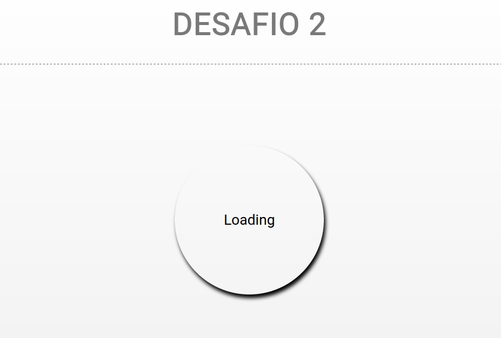
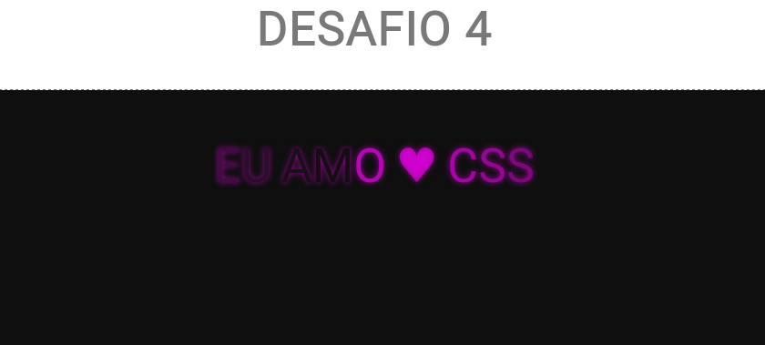

# Project CSS
Desafio de Css, Criar Eventos e formatações variadas
Seguindo varios desafios já existentes para testar minhas abilidades e conhecimento.

**Desafio 1:**
> Icones da rede social 

**Desafio 2:**
> Loading Wheel

**Desafio 3:**
> Hover Buttom

**Desafio 4:**
> Movimento em Letras. 

 
**Desafio 5:**
> Wating

